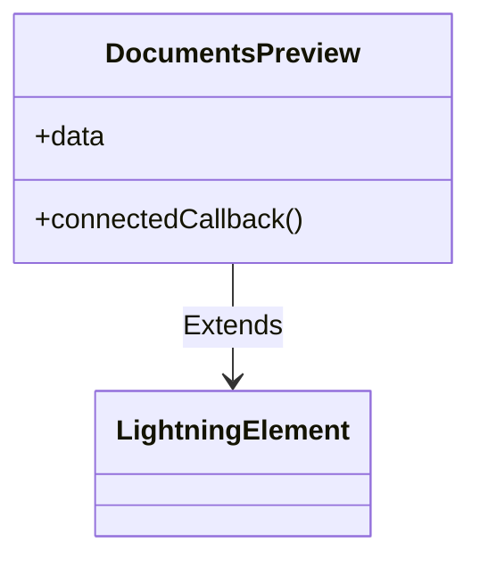

# Documentação do arquivo `documentsPreview.js`

## Introdução
O arquivo `documentsPreview.js` é um componente Lightning Web Component (LWC) que tem como objetivo exibir uma pré-visualização de documentos. Ele utiliza dados estruturados em formato JSON para representar informações detalhadas sobre os documentos, como metadados, contexto de criação, validações e URLs de imagens.

## Descrição
Este componente é responsável por carregar e processar dados de documentos em formato JSON, transformando-os em um objeto JavaScript para uso interno. Ele utiliza o método `connectedCallback` para inicializar os dados quando o componente é montado. Os dados incluem informações como chave do documento, detalhes do arquivo, metadados, contexto de criação, relações entre documentos, validações e URLs de imagens.

## Estrutura
O arquivo contém:
- Importação do módulo `LightningElement` da biblioteca LWC.
- Declaração da classe `DocumentsPreview`, que estende `LightningElement`.
- Propriedade `data` para armazenar os dados dos documentos.
- Método `connectedCallback` para inicializar os dados ao montar o componente.

## Dependências
Este arquivo depende do seguinte módulo:
- `LightningElement` da biblioteca LWC.

## Imports
```javascript
import { LightningElement } from 'lwc';
```

## Variáveis
- `data`: Armazena os dados dos documentos após serem processados pelo método `JSON.parse`.

## Métodos

### `connectedCallback()`
Este método é chamado automaticamente quando o componente é montado. Ele realiza as seguintes ações:
1. Define uma string `payload` contendo os dados dos documentos em formato JSON.
2. Converte a string JSON em um objeto JavaScript utilizando `JSON.parse`.
3. Armazena o objeto resultante na propriedade `data`.

#### Estrutura do JSON
O JSON contém:
- **items**: Lista de documentos.
  - **documentKey**: Identificador único do documento.
  - **details**: Informações sobre o arquivo (nome, extensão, tamanho, autor e data de criação).
  - **metadata**: Metadados do documento, incluindo classificação e conteúdo.
  - **creationContext**: Contexto de criação do documento, como canal, produto e aplicação.
  - **relations**: Relações com outros documentos.
  - **validations**: Validações realizadas no documento.
  - **url**: URL da imagem do documento.

## Exemplo
Abaixo está um exemplo de como o componente processa os dados:

```javascript
connectedCallback() {
    let payload = '{...}'; // JSON contendo os dados dos documentos
    this.data = JSON.parse(payload); // Converte o JSON em objeto JavaScript
}
```

Após a execução, a propriedade `data` conterá um objeto com a seguinte estrutura:

```javascript
{
  items: [
    {
      documentKey: "DOC-12345678",
      details: {
        file: "passport_cover",
        extension: "jpg",
        size: "3MB",
        author: "Catherine Spotsky",
        createdAt: "2020-06-02T15:20:35Z"
      },
      metadata: {
        classification: {
          group: "PROOF_IDENTITY",
          type: "CNH_BRAZILIAN_IDENTITY",
          side: "FRONT"
        },
        content: {
          name: "Zé Jão da silva",
          number: "666666-6"
        }
      },
      creationContext: {
        channel: "Whatsapp",
        product: "AUTO_FIN",
        application: {
          id: "a58d82b6-7cd4-4d6b-b637-3b1bd82fcce5",
          participantsMainDocument: [12345678901]
        }
      },
      relations: [
        {
          relatedWith: "DOC-1234",
          relationType: "IS_OTHER_SIDE_OF"
        }
      ],
      validations: [
        {
          validationType: "UNKNOWN",
          result: "APPROVED",
          resultDetails: "Pending",
          whoValidated: "OPERATOR",
          productName: "AUTO_FIN",
          validationDate: "2020-02-29T23:20:35Z"
        }
      ],
      url: "https://i0.wp.com/trucao.com.br/wp-content/uploads/2017/12/cnh_cartao_destaque.jpg?fit=1920%2C1080&ssl=1"
    }
  ]
}
```

## Diagrama de Dependência
Abaixo está um diagrama de dependência que ilustra a relação entre os principais elementos do código:



## Notas
- O componente utiliza o método `JSON.parse` para converter a string JSON em um objeto JavaScript. Certifique-se de que o JSON fornecido esteja bem formatado para evitar erros.
- A propriedade `data` pode ser utilizada em templates LWC para exibir informações dos documentos.

## Vulnerabilidades
- **Validação de Dados**: O código não realiza validação do JSON antes de processá-lo. Caso o JSON seja malformado ou contenha dados inesperados, pode causar erros.
- **Segurança de URL**: As URLs fornecidas no JSON são diretamente utilizadas. Certifique-se de que as URLs sejam confiáveis para evitar problemas de segurança, como ataques de phishing ou conteúdo malicioso.
