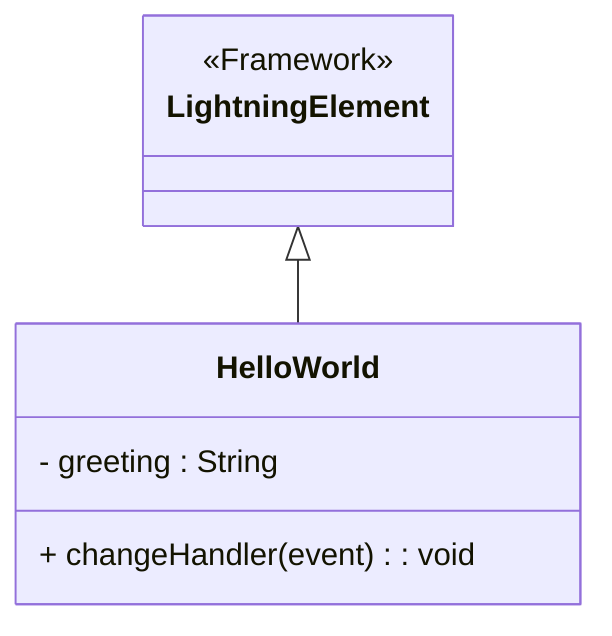

# Documentação do arquivo helloWorld.js

## Introdução
Este arquivo contém a implementação de um componente básico em Lightning Web Components (LWC) chamado `HelloWorld`. Ele demonstra como criar um componente simples que interage com o usuário, permitindo a atualização de uma saudação com base na entrada do usuário.

## Descrição
O código define um componente LWC que exibe uma saudação padrão ("World") e permite que o usuário a altere por meio de uma entrada de texto. A classe `HelloWorld` estende a classe base `LightningElement`, que é fornecida pelo framework LWC. O componente utiliza a propriedade `greeting` para armazenar o valor da saudação e o método `changeHandler` para atualizar essa propriedade com base no valor inserido pelo usuário.

## Estrutura
O arquivo possui a seguinte estrutura:
1. Importação do módulo `LightningElement` do framework LWC.
2. Definição da classe `HelloWorld`, que estende `LightningElement`.
3. Declaração de uma propriedade pública `greeting` com valor inicial "World".
4. Implementação do método `changeHandler` para manipular eventos de entrada do usuário.

## Dependências
Este arquivo depende do módulo `LightningElement` do framework Lightning Web Components (LWC).

## Imports
O arquivo importa o seguinte módulo:
- `LightningElement` do pacote `lwc`.

## Variáveis
- `greeting`: Uma propriedade pública que armazena a saudação atual. Inicialmente, é definida como "World".

## Métodos
### `changeHandler(event)`
Este método é chamado sempre que ocorre um evento de entrada no campo de texto associado. Ele atualiza a propriedade `greeting` com o valor inserido pelo usuário.

**Parâmetros:**
- `event`: O objeto de evento que contém informações sobre o evento de entrada. O valor inserido pelo usuário pode ser acessado por meio de `event.target.value`.

**Funcionamento:**
1. O método é acionado por um evento de entrada.
2. Ele acessa o valor do campo de entrada por meio de `event.target.value`.
3. Atualiza a propriedade `greeting` com o novo valor.

## Exemplo
Aqui está um exemplo de como o componente pode ser usado em um arquivo HTML associado:

```html
<template>
  <h1>Hello, {greeting}!</h1>
  <input type="text" placeholder="Digite seu nome" onchange={changeHandler} />
</template>
```

Neste exemplo:
- O valor de `greeting` é exibido dentro de um elemento `<h1>`.
- Um campo de entrada permite que o usuário insira um novo valor para a saudação.
- O método `changeHandler` é chamado sempre que o valor do campo de entrada muda.

## Diagrama de Dependência
O diagrama abaixo ilustra a relação entre a classe `HelloWorld` e o módulo `LightningElement`:



## Notas
- Este é um exemplo básico de um componente LWC. Ele pode ser expandido para incluir funcionalidades mais complexas, como validação de entrada ou integração com outros componentes.
- Certifique-se de que o arquivo HTML associado ao componente esteja configurado corretamente para que o método `changeHandler` seja chamado.

## Vulnerabilidades
Nenhuma vulnerabilidade conhecida foi identificada neste código. No entanto, é importante considerar:
- Validação de entrada: Se o valor de `greeting` for usado em outro lugar, como em uma API ou banco de dados, é recomendável validar e sanitizar a entrada do usuário para evitar problemas de segurança, como injeção de código.
