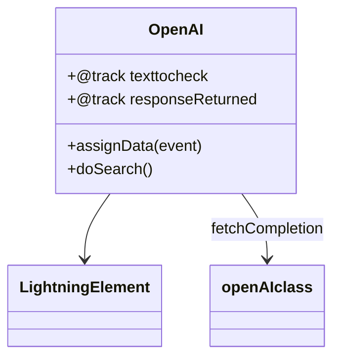

# Documentação do arquivo openAI.js

## Introdução
Este arquivo contém a implementação de um componente Lightning Web Component (LWC) chamado `OpenAI`. Ele é projetado para interagir com uma classe Apex no Salesforce chamada `openAIclass` para realizar uma verificação de texto usando a API de conclusão de texto do OpenAI.

## Descrição
O componente `OpenAI` permite que os usuários insiram um texto em um campo de entrada, enviem esse texto para o backend (classe Apex) e recebam uma resposta processada. A interação com o backend é feita por meio de um método Apex chamado `textcompletionCeck`, que é importado no início do arquivo.

## Estrutura
O arquivo é estruturado da seguinte forma:
1. Importação de módulos e dependências.
2. Declaração de variáveis rastreáveis para armazenar o texto de entrada e a resposta retornada.
3. Métodos para manipular eventos de entrada do usuário e realizar a chamada ao backend.

## Dependências
Este arquivo depende de:
- `LightningElement`, `track` e `api` do módulo `lwc` para criar e gerenciar o componente.
- Método Apex `textcompletionCeck` da classe `openAIclass` para processar o texto.

## Imports
```javascript
import { LightningElement, track, api } from 'lwc';
import fetchCompletion from '@salesforce/apex/openAIclass.textcompletionCeck';
```

### Descrição dos Imports:
- `LightningElement`: Classe base para criar componentes LWC.
- `track`: Decorador usado para tornar as propriedades reativas.
- `api`: Decorador usado para expor propriedades para outros componentes.
- `fetchCompletion`: Método Apex importado para realizar a verificação de texto.

## Variáveis
### `@track texttocheck`
- **Descrição**: Armazena o texto inserido pelo usuário no campo de entrada.
- **Tipo**: `String`
- **Uso**: Atualizado sempre que o usuário digita no campo de entrada.

### `@track responseReturned`
- **Descrição**: Armazena a resposta retornada pelo método Apex após o processamento do texto.
- **Tipo**: `String`
- **Uso**: Atualizado após a chamada bem-sucedida ao método Apex.

## Métodos
### `assignData(event)`
- **Descrição**: Método chamado quando o usuário digita no campo de entrada. Ele atualiza a variável `texttocheck` com o valor inserido.
- **Parâmetros**:
  - `event`: Objeto de evento que contém o valor do campo de entrada.
- **Funcionamento**:
  - Obtém o valor do campo de entrada a partir de `event.target.value`.
  - Atualiza a variável `texttocheck`.
  - Exibe o valor no console para depuração.

### `doSearch()`
- **Descrição**: Método chamado para enviar o texto inserido ao backend e processar a resposta.
- **Funcionamento**:
  - Chama o método Apex `fetchCompletion`, passando o texto armazenado em `texttocheck`.
  - Atualiza a variável `responseReturned` com o resultado retornado.
  - Exibe o resultado no console para depuração.
  - Em caso de erro, exibe um alerta com os detalhes do erro.

## Exemplo
Abaixo está um exemplo de como o componente pode ser usado em um arquivo HTML:

```html
<template>
    <lightning-card title="OpenAI Text Completion">
        <div class="slds-m-around_medium">
            <lightning-input 
                label="Digite o texto para verificar" 
                onchange={assignData}>
            </lightning-input>
            <lightning-button 
                label="Verificar Texto" 
                onclick={doSearch}>
            </lightning-button>
            <p>Resposta Retornada: {responseReturned}</p>
        </div>
    </lightning-card>
</template>
```

## Diagrama de Dependências
O diagrama abaixo ilustra as dependências do componente `OpenAI`:



## Notas
- Certifique-se de que a classe Apex `openAIclass` e o método `textcompletionCeck` estejam implementados corretamente no Salesforce.
- O método Apex deve estar exposto como `@AuraEnabled` para ser acessível pelo LWC.
- O componente pode ser estendido para incluir validações adicionais ou manipulação de erros mais robusta.

## Vulnerabilidades
- **Erro de Rede**: Se a chamada ao método Apex falhar devido a problemas de rede, o componente exibirá um alerta com os detalhes do erro.
- **Validação de Entrada**: Atualmente, não há validação para o texto inserido pelo usuário. É recomendável adicionar validações para evitar entradas inválidas ou maliciosas.
