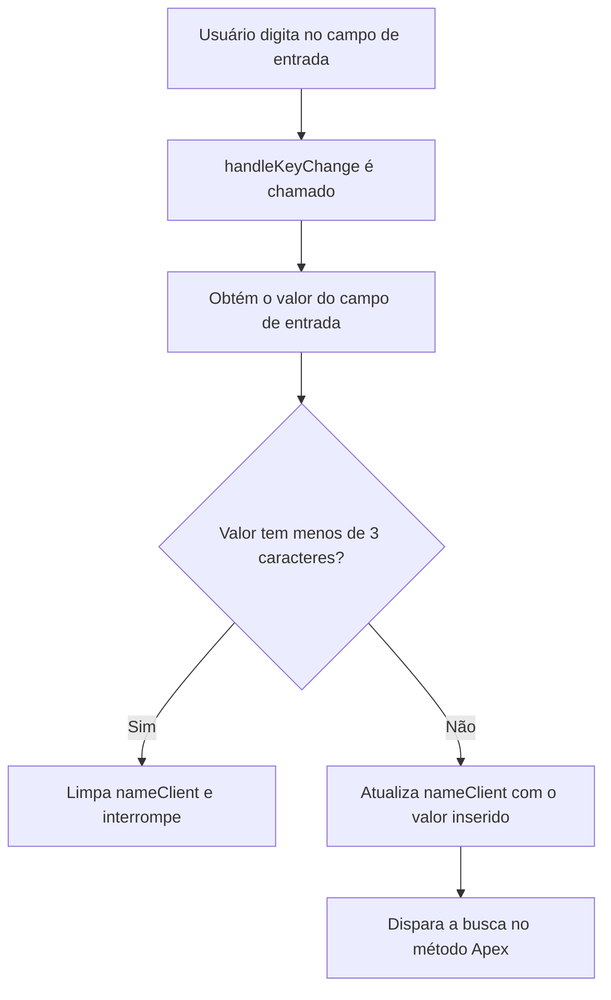
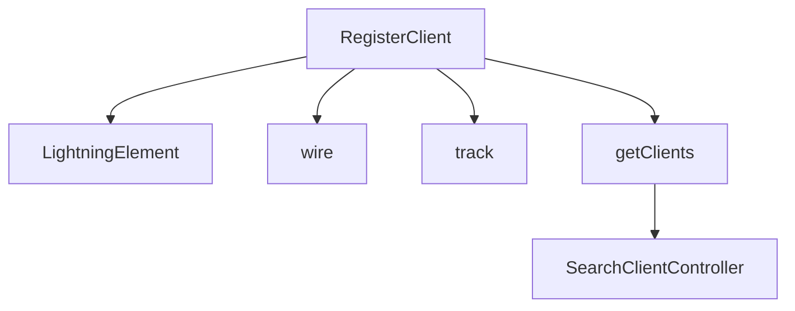

# Documentação do arquivo registerClient.js

## Introdução
Este arquivo contém a implementação de um componente Lightning Web Component (LWC) chamado `RegisterClient`. Ele é utilizado para buscar e exibir uma lista de clientes com base no nome fornecido pelo usuário. A busca é realizada através de uma chamada para um método Apex no Salesforce.

## Descrição
O componente `RegisterClient` permite que o usuário insira um nome parcial ou completo de um cliente em um campo de entrada. Quando o nome inserido tem pelo menos 3 caracteres, o componente realiza uma busca utilizando o método Apex `searchClients` e exibe os resultados. Caso o nome tenha menos de 3 caracteres, a busca é interrompida e os resultados são limpos.

## Estrutura
O arquivo é estruturado da seguinte forma:
1. Importação de módulos e dependências.
2. Declaração da classe `RegisterClient`, que estende `LightningElement`.
3. Definição de variáveis rastreadas (`@track`) e propriedades reativas (`@wire`).
4. Implementação de métodos para manipulação de eventos.

## Dependências
Este arquivo depende dos seguintes módulos e recursos:
- `LightningElement`, `wire` e `track` do módulo `lwc`.
- Método Apex `searchClients` do controlador `SearchClientController`.

## Imports
Os seguintes módulos e recursos são importados:
```javascript
import { LightningElement, wire, track } from 'lwc';
import getClients from '@salesforce/apex/SearchClientController.searchClients';
```

## Variáveis
- `nameClient`: Variável rastreada (`@track`) que armazena o nome do cliente inserido pelo usuário. É utilizada como parâmetro para a busca no método Apex.
- `clients`: Propriedade reativa (`@wire`) que armazena os resultados da busca retornados pelo método Apex.

## Métodos
### `handleKeyChange(event)`
Este método é chamado sempre que o usuário digita algo no campo de entrada. Ele realiza as seguintes ações:
1. Obtém o valor do campo de entrada através de `event.target.value`.
2. Verifica se o valor tem menos de 3 caracteres:
   - Se sim, limpa a variável `nameClient` e interrompe a execução.
   - Se não, atualiza a variável `nameClient` com o valor inserido.
3. A atualização de `nameClient` dispara automaticamente a busca no método Apex devido à propriedade reativa `@wire`.

### Fluxo do método `handleKeyChange`


## Exemplo
Abaixo está um exemplo de como o componente pode ser utilizado em um arquivo HTML:
```html
<template>
    <lightning-input 
        label="Nome do Cliente" 
        onchange={handleKeyChange}>
    </lightning-input>
    <template if:true={clients.data}>
        <ul>
            <template for:each={clients.data} for:item="client">
                <li key={client.Id}>{client.Name}</li>
            </template>
        </ul>
    </template>
</template>
```

## Diagrama de Dependências
O diagrama abaixo ilustra as dependências do componente `RegisterClient`:



## Notas
- O método Apex `searchClients` deve estar devidamente implementado no controlador `SearchClientController` no Salesforce.
- O componente utiliza a anotação `@wire` para realizar chamadas reativas ao método Apex, o que simplifica a integração com o backend.

## Vulnerabilidades
- **Validação de entrada**: O código não realiza validações adicionais no valor inserido pelo usuário. Dependendo da implementação do método Apex, pode ser necessário sanitizar a entrada para evitar problemas de segurança, como injeção de código.
- **Desempenho**: A busca é disparada sempre que o valor de `nameClient` é atualizado. Em cenários com muitos usuários simultâneos, isso pode sobrecarregar o servidor. Uma solução seria implementar um mecanismo de debounce para reduzir a frequência das chamadas ao método Apex.
