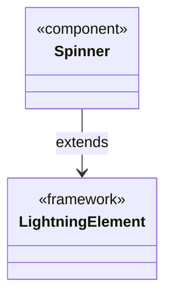

# Documentação do arquivo spinner.js

## Introdução
O arquivo `spinner.js` é um componente básico desenvolvido utilizando o framework Lightning Web Components (LWC). Ele serve como base para a criação de um spinner, que é um elemento visual comumente usado para indicar que uma operação está em andamento.

## Descrição
Este arquivo define um componente chamado `Spinner`, que herda da classe base `LightningElement`. Ele é usado para encapsular a lógica e o comportamento de um spinner em uma aplicação Salesforce. O componente pode ser reutilizado em diferentes partes da aplicação para fornecer feedback visual ao usuário enquanto uma operação assíncrona está sendo executada.

## Estrutura
O arquivo possui uma estrutura simples, contendo:
- Uma importação da classe `LightningElement` do módulo `lwc`.
- Uma classe `Spinner` que estende `LightningElement` e é exportada como padrão.

## Dependências
O arquivo depende do seguinte módulo:
- `lwc`: Fornece a classe base `LightningElement`, que é essencial para criar componentes no framework Lightning Web Components.

## Imports
O arquivo importa:
- `LightningElement` do módulo `lwc`.

```javascript
import { LightningElement } from 'lwc';
```

## Variáveis
Este arquivo não define variáveis.

## Métodos
O arquivo não contém métodos definidos. Ele apenas declara a classe `Spinner`, que herda os métodos e propriedades padrão de `LightningElement`.

## Exemplo
Abaixo está um exemplo de como usar o componente `Spinner` em um arquivo HTML de um projeto LWC:

```html
<template>
    <c-spinner></c-spinner>
</template>
```

Neste exemplo, o componente `Spinner` é incluído em um template HTML. Ele pode ser estilizado e configurado conforme necessário para atender aos requisitos da aplicação.

## Diagrama de Dependência
O diagrama abaixo ilustra a dependência do componente `Spinner` em relação ao módulo `lwc`:



## Notas
- Este componente é apenas uma base e não contém lógica ou propriedades adicionais. Para adicionar funcionalidades específicas, é necessário estender ou modificar a classe `Spinner`.
- O arquivo `spinner.js` deve ser acompanhado por um arquivo de template HTML (`spinner.html`) e, opcionalmente, um arquivo de estilo CSS (`spinner.css`) para definir a aparência do spinner.

## Vulnerabilidades
Nenhuma vulnerabilidade foi identificada neste arquivo, pois ele contém apenas uma definição básica de classe sem lógica adicional. No entanto, é importante garantir que o uso do componente em outros contextos seja seguro e siga as melhores práticas de desenvolvimento.
