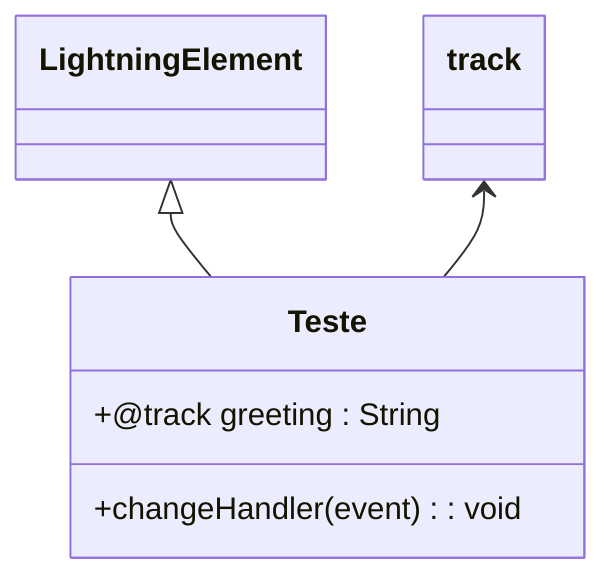

# Documentação do arquivo teste.js

## Introdução
Este arquivo contém a implementação de um componente Lightning Web Component (LWC) chamado `Teste`. Ele demonstra o uso de propriedades rastreáveis (`@track`) e manipulação de eventos para atualizar o estado do componente.

## Descrição
O código define um componente LWC que exibe uma saudação dinâmica. A saudação pode ser alterada pelo usuário através de uma entrada de texto. O componente utiliza a anotação `@track` para tornar a propriedade `greeting` reativa, permitindo que o valor seja atualizado e refletido automaticamente na interface do usuário.

## Estrutura
O arquivo possui a seguinte estrutura:
- Importação de módulos necessários do framework LWC.
- Definição da classe `Teste`, que estende `LightningElement`.
- Declaração de uma propriedade rastreável (`greeting`).
- Implementação de um método para manipular eventos de entrada de texto.

## Dependências
Este arquivo depende dos seguintes módulos:
- `LightningElement`: Base para criar componentes LWC.
- `track`: Decorador usado para tornar propriedades reativas.

## Imports
Os seguintes módulos são importados:
```javascript
import { LightningElement, track } from 'lwc';
```

## Variáveis
### `greeting`
- **Descrição**: Propriedade rastreável que armazena a saudação atual.
- **Tipo**: `String`
- **Valor Inicial**: `'World'`
- **Uso**: Atualizada dinamicamente com base na entrada do usuário.

## Métodos
### `changeHandler(event)`
- **Descrição**: Manipula eventos de entrada de texto e atualiza a propriedade `greeting` com o valor inserido pelo usuário.
- **Parâmetros**:
  - `event`: Objeto de evento que contém informações sobre a entrada do usuário.
- **Retorno**: Nenhum.
- **Funcionamento**:
  - Obtém o valor do campo de entrada através de `event.target.value`.
  - Atualiza a propriedade `greeting` com o valor obtido.

## Exemplo
Aqui está um exemplo de como usar o componente `Teste`:

```html
<template>
    <h1>Hello, {greeting}!</h1>
    <input type="text" onchange={changeHandler} />
</template>
```

Neste exemplo:
- O texto "Hello, World!" será exibido inicialmente.
- Quando o usuário digitar algo no campo de entrada, o texto será atualizado dinamicamente para refletir o valor inserido.

## Diagrama de Dependência
Abaixo está um diagrama de dependência que ilustra a relação entre os módulos e a classe:



## Notas
- A anotação `@track` é usada para tornar a propriedade `greeting` reativa. No entanto, em versões mais recentes do LWC, o uso de `@track` pode ser opcional para propriedades simples.
- Certifique-se de que o arquivo HTML correspondente ao componente esteja configurado corretamente para exibir e manipular a propriedade `greeting`.

## Vulnerabilidades
Nenhuma vulnerabilidade aparente foi identificada neste código. No entanto, é importante validar a entrada do usuário para evitar possíveis problemas de segurança, como ataques de injeção.
