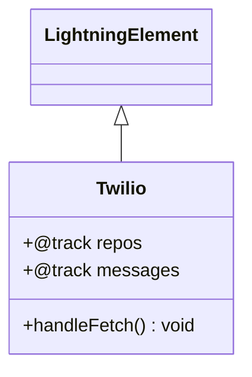

# Documentação do arquivo twilio.js

## Introdução
Este arquivo contém a implementação de um componente Lightning Web Component (LWC) chamado `Twilio`. Ele é projetado para interagir com a API do Twilio, especificamente para buscar mensagens enviadas em uma data específica.

## Descrição
O componente `Twilio` utiliza a API do Twilio para buscar mensagens enviadas em uma data específica. Ele faz isso através de uma chamada `fetch` para o endpoint da API do Twilio. Os dados retornados são armazenados em uma variável rastreável (`@track`) chamada `repos`, que pode ser usada para exibir as mensagens no componente.

## Estrutura
O arquivo é estruturado da seguinte forma:
1. Importação de módulos necessários do LWC.
2. Declaração da classe `Twilio` que estende `LightningElement`.
3. Definição de variáveis rastreáveis para armazenar os dados.
4. Implementação do método `handleFetch` para buscar os dados da API do Twilio.

## Dependências
Este arquivo depende dos seguintes módulos:
- `LightningElement` e `track` do LWC.

## Imports
```javascript
import { LightningElement, track } from 'lwc';
```

## Variáveis
- `@track repos`: Armazena os dados retornados pela API do Twilio.
- `@track messages`: Variável rastreável que pode ser usada para armazenar mensagens específicas (não utilizada diretamente no código fornecido).

## Métodos

### `handleFetch()`
Este método é responsável por buscar os dados da API do Twilio. Ele realiza os seguintes passos:
1. Define o endpoint da API do Twilio, incluindo a data específica para filtrar as mensagens.
2. Faz uma chamada `fetch` com o método `GET` e um cabeçalho de autorização básico.
3. Converte a resposta para JSON e armazena os dados na variável `repos`.
4. Exibe no console as mensagens retornadas.

#### Fluxo do método
1. **Definição do endpoint**: O endpoint é configurado para buscar mensagens enviadas em `2021-12-15`.
2. **Chamada `fetch`**: A chamada é feita com o método `GET` e um cabeçalho de autorização básico (que precisa ser preenchido com credenciais válidas).
3. **Processamento da resposta**: A resposta é convertida para JSON e armazenada na variável `repos`.
4. **Exibição no console**: As mensagens são exibidas no console.

## Exemplo
Aqui está um exemplo de como o componente pode ser usado:
```javascript
import { LightningElement } from 'lwc';
import Twilio from './twilio';

export default class App extends LightningElement {
    connectedCallback() {
        const twilioComponent = new Twilio();
        twilioComponent.handleFetch();
    }
}
```

## Diagrama de Dependências
O diagrama abaixo ilustra as dependências do código:



## Notas
- O cabeçalho de autorização (`Authorization`) está incompleto. Para que o código funcione corretamente, é necessário fornecer as credenciais do Twilio no formato `Basic <Base64EncodedCredentials>`.
- A variável `messages` é declarada, mas não é utilizada no código fornecido. Pode ser removida ou implementada conforme necessário.
- O código não trata erros na chamada `fetch`. É recomendável adicionar um bloco `catch` para lidar com possíveis falhas.

## Vulnerabilidades
- **Exposição de Credenciais**: O endpoint contém informações sensíveis, como o SID da conta. Certifique-se de não expor essas informações em ambientes públicos.
- **Falta de Tratamento de Erros**: O código não possui tratamento de erros para a chamada `fetch`. Isso pode causar falhas silenciosas em caso de problemas na conexão ou na API.
- **Autenticação Incompleta**: O cabeçalho de autorização está vazio, o que impede a autenticação na API do Twilio. Certifique-se de preencher corretamente antes de usar o código.


